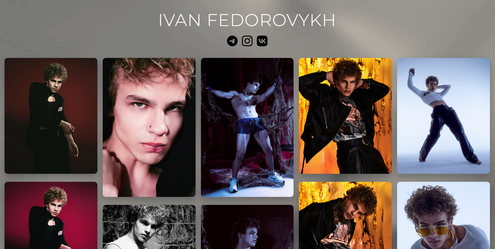
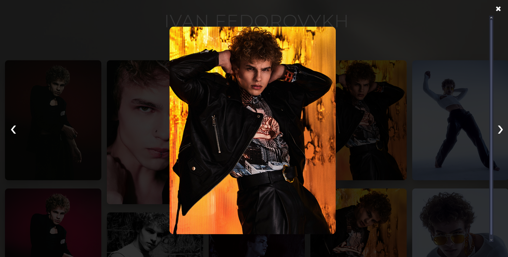

## 🎨 Превью дизайна

# IVAN FEDOROVYKH — модельное портфолио

 Веб-сайт-портфолио модели Ивана Федоровых.  
Проект выполнен с упором на минимализм, стиль и адаптивность.

##  Что внутри:
- адаптивная галерея в стиле Pinterest
- плавные анимации появления
- фон с цикличной гифкой и затемнением
- модальное окно с масштабированием фото
- социальные ссылки с анимацией

##  GitHub Pages:
[Открыть сайт](https://shak2o.github.io/ivan-site/)  

##  Стек:
- HTML + CSS (чисто и без фреймворков)
- JavaScript (модальное окно, скролл-анимации)
- адаптивность под мобильные

---

##  Автор
Разработка и оформление — [shak2o (Денис)](https://github.com/shak2o)  